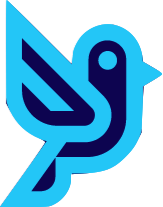
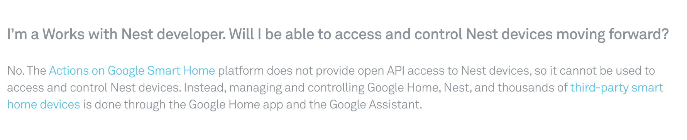
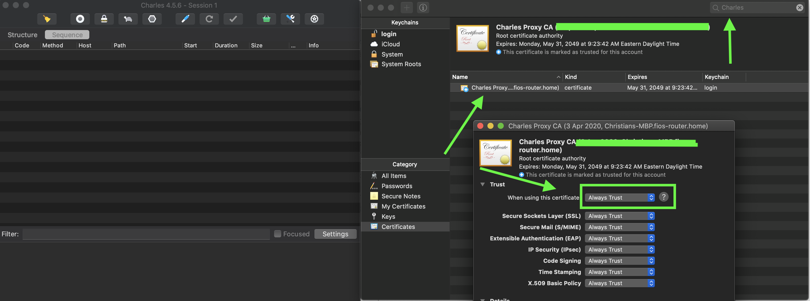
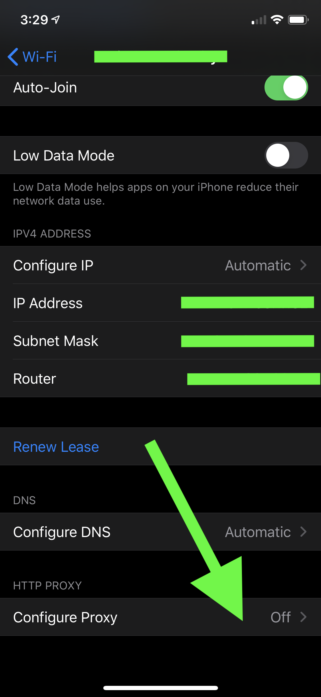
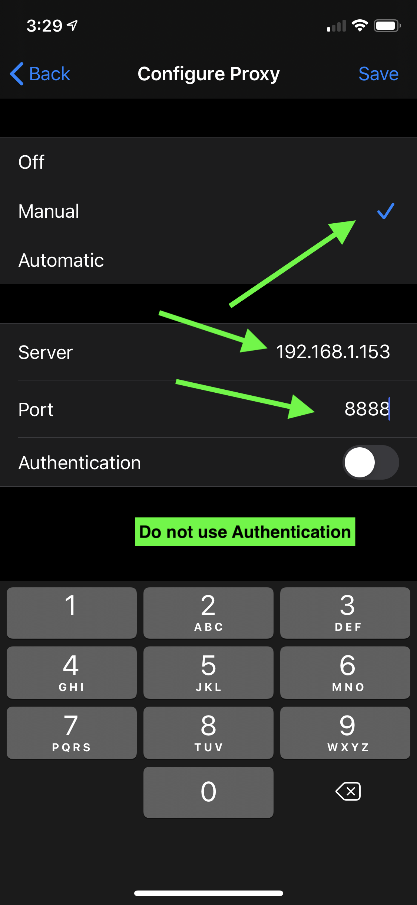
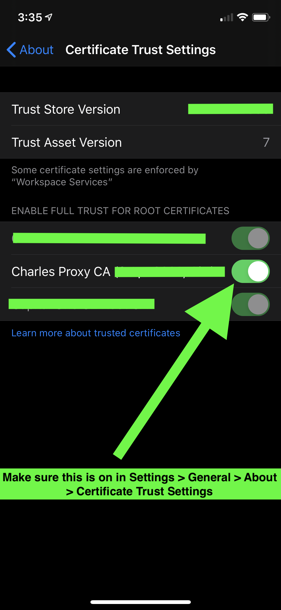
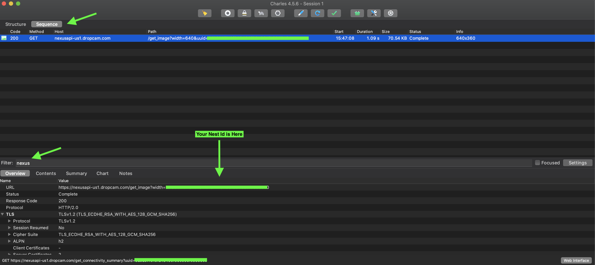
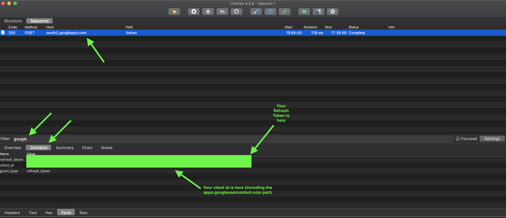
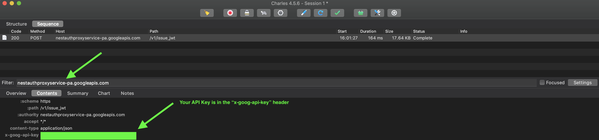

<p align="center">
    
</p>

# Nest Camera SDK


Access & Stream the Nest API Camera data through a Reactive Node.JS interface. 

In 2019 Google deprecated the Works With Nest program and shut down the Nest API's for new developers and pigeon hole'd the existing Nest developers
to migrate their Nest account's to Google. Google integrated the Nest products under the "Works With Google" umbrella and essentially made data access to your own
Nest devices a one way street.

You can give your Nest data to Google but you can't get it back out of the cloud. I am a fan of open source IoT and I think this is pretty uncool. This Nest Camera SDK aims
aims to give developers the freedom and ability to access their own camera feed data in order to continue building great applications.



## Quick Start

To get started with the Unofficial Nest Camera API you can install the package from [NPM](https://npmjs.com): 

```shell script
$ npm install nest-cam
```

### Examples

You can do a whole lot more with the Nest Camera SDK but here is a quick example to get you started:

```javascript
const Nest = require('nest-cam');

const nest = new Nest({
    nestId: "YOUR_NEST_ID",
    refreshToken: "YOUR_REFRESH_TOKEN",
    apiKey: "YOUR_API_KEY",
    clientId: "YOUR_CLIENT_ID"
});

nest.init().then(() => {
    nest.saveLatestSnapshot('/User/me/camera/images/my_image.jpg');
    ...
});
```

### Prerequisites

Before you go hooking into your camera data you will need some security credentials. Check out the table below for a description
of each credential.

| **Name**       | **Data Type** | **Description**                                                                                                                                                                                                                                                   |
|----------------|---------------|-------------------------------------------------------------------------------------------------------------------------------------------------------------------------------------------------------------------------------------------------------------------|
| `nestId`       | String        | A unique string which identifies your Nest Camera to the Google Nest API. This value will not change.                                                                                                                                                             |
| `refreshToken` | String        | Nest uses OAuth 2.0 to securely authenticate users. A refresh token allows an application to obtain a new OAuth access token without prompting the user for any information. This is a long lived token which will expire but not for an estimated several weeks. |
| `apiKey`       | String        | This value comes with special privileges to tell the Nest servers how often the client wielding the api key can call the backend. This value will not change.                                                                                                     |
| `clientId`     | String        | The Client Id is a unique string which is used by the Nest API to identify which client or application is calling the backend resources.                                                                                                                          |

Retrieving these values can be somewhat cumbersome but I will do my best to make the process as painless as possible. 

## Obtaining Nest Security Credentials

To get the security credentials you will have to setup a proxy on the same WiFi network as your Nest Camera. We will proxy requests from your Android or iPhone 
through the Nest app (and our proxy) to intercept the security credentials before they get to the Nest servers. Don't worry this is **way** easier than it sounds.
This tutorial is written for the Mac & iOS but works in a similar fashion on Windows and Android. Please consult the [Charles Documentation](https://www.charlesproxy.com/documentation/using-charles/ssl-certificates/) to
learn how to trust the SSL certificates on a Windows machine. 

### Installing Charles Proxy

First head to the [Charles Proxy Website](https://www.charlesproxy.com/) and download and install the proxy software. Next we are going to configure
Charles to trust all SSL certificates it proxies so that we can see the request's and response's that Nest uses to communicate with its API's (The credentials you are after are in these requests and responses). 

### Trusting the Root Charles SSL Certificate

Charles generates its own certificates for sites, which it signs using a Charles Root Certificate, which is uniquely generated for your installation of Charles (as of v3.10). In order
to avoid having to trust each website you visit individually you can simply trust the Charles Root Certificate one time and it will take care of everything else for you.

You need to trust the certificates on your Mac/Windows and iPhone/Android

#### Mac 

In Charles go to the Help menu and choose "SSL Proxying > Install Charles Root Certificate". Keychain Access will open. Find the "Charles Proxy..." entry, and double-click to get info on it. 
Expand the "Trust" section, and beside "When using this certificate" change it from "Use System Defaults" to "Always Trust". 
Then close the certificate info window, and you will be prompted for your Administrator password to update the system trust settings. 

 

#### iOS

In order to install the Charles Trust Certificate on iOS there are a couple simple steps.

Set your iOS device to use Charles as its HTTP proxy in the Settings app > Wifi settings. For the IP Address set the IP
address for the device that is running the charles proxy. This is usually something like: `192.168.1.153`. The port will always be `8888`
and there is no Authentication.

**Go into your Wifi setting:**



**Update your proxy**




Open Safari and browse to [https://chls.pro/ssl](https://chls.pro/ssl). Safari will prompt you to install the SSL certificate.
If you are on iOS 10.3 or later, open the Settings.app and navigate to General > About > Certificate Trust Settings, and find the Charles Proxy certificate, 
and switch it on to enable full trust for it (More information about this change in iOS 10).



Done!

### Capturing Nest Traffic

Now that you have your iOS/Android device configured to route traffic through the Charles Proxy you are ready to start intercepting Nest camera requests to
locate your credentials!

#### Nest ID

The Nest Id is easy to find. Fire up your Nest App on your phone and watch Charles Proxy capture the traffic! 

Make sure you:

- Set your Charles Proxy to use "Sequence". This ensures you see requests in the order they were sent
- Filter for the word "nexus". This will get rid of requests you dont care about (there will be a lot of them)



Your nest ID is highlighted in the picture above.

#### Refresh Token & Client Id

In Charles Proxy:

- Filter for "google"
- Look for the request from the host: `oauth2.googleapis.com`
- Select "Contents" (right beneath the filter bar) to view the contents of the Http Request



Your client id and refresh token are highlighted in the picture above.

#### API Key

Finally your API key can be located by:

- Filtering for "nestauthproxyservice"
- It is located in the "x-goog-api-key" Header value



That's it your done!

## About the SDK

This section describes how to use the Nest SDK to retrieve images, fetch events, and stream data
from your Nest camera.

### Initializing the SDK

You **must** call the `init()` method after initializing the Nest SDK. The init method will fetch your OAuth access_token and JWT token
used to retrieve data from the Nest API the other functions within the SDK.

### Events

The Nest SDK works around events. An event is logged by your Nest camera whenever it detects motion or sound. You can periodically
fetch Nest events through the API or subscribe to the event stream and be notified when a new event arrives.

The event object looks like this:

```javascript
 {
    "playback_time": 1586551361730,
    "start_time": 1586551361730,
    "camera_uuid": "<Your Nest Id>",
    "face_id": "",
    "is_important": false,
    "face_category": "UNSET",
    "end_time": 1586551371619,
    "importance": 0,
    "face_name": "",
    "in_progress": false,
    "id": "1586551361-labs",
    "zone_ids": [],
    "types": ["motion"]
}
```

### Streaming Events

The streaming interface for the Nest SDK is built on top of Reactive programming and [RxJS](https://rxjs-dev.firebaseapp.com/). It uses [Observables](https://rxjs-dev.firebaseapp.com/guide/observable) as the fundamental unit to 
stream Nest camera data directly to your applications. Events are streamed using the `nest.subscribe()` method. You must specify the event type you wish to subscribe to either "event" or "snapshot".

You can poll for two different types of data:

- Snapshots - The latest snapshot image from the Nest camera
- Events - The latest JSON event from the Nest API 

Under the hood the streaming Observables will poll the Nest API at regular intervals for updates on new events (using you guessed it `getEvents()`)! You can configure how often
the observables poll the Nest API by passing values into the Nest constructor at start up. The values default to five seconds for snapshots and three seconds for events.

## Examples

Here are some helpful examples to get you started.

### Fetching Camera Events

You can fetch all the latest events for your camera using the snippet below. You can also specify a start and end
time as parameters to the `getEvents()` method. For example `nest.getEvents('1586551371619', '1586551374320')`

```javascript
const Nest = require('nest-cam');

const nest = new Nest({
    nestId: "YOUR_NEST_ID",
    refreshToken: "YOUR_REFRESH_TOKEN",
    apiKey: "YOUR_API_KEY",
    clientId: "YOUR_CLIENT_ID"
});

nest.init().then(() => {
    nest.getEvents().then(events => {
        ...
    }).catch(err => console.log('Failed to fetch events: ', err));
});
```

### Streaming Camera Events

```javascript
const Nest = require('nest-cam');

const nest = new Nest({
    nestId: "YOUR_NEST_ID",
    refreshToken: "YOUR_REFRESH_TOKEN",
    apiKey: "YOUR_API_KEY",
    clientId: "YOUR_CLIENT_ID"
});

nest.init().then(() => {
    nest.subscribe('event', (event) => {
        ...
    })
});
```

### Fetching Latest Image

```javascript
const Nest = require('nest-cam');

const nest = new Nest({
    nestId: "YOUR_NEST_ID",
    refreshToken: "YOUR_REFRESH_TOKEN",
    apiKey: "YOUR_API_KEY",
    clientId: "YOUR_CLIENT_ID"
});

nest.init().then(() => {
    nest.saveLatestSnapshot('/path/to/image.jpg').then((path) => {
        // ... image saved successfully 
    });
});
```

### Fetching Event Image

```javascript
const Nest = require('nest-cam');

const nest = new Nest({
    nestId: "YOUR_NEST_ID",
    refreshToken: "YOUR_REFRESH_TOKEN",
    apiKey: "YOUR_API_KEY",
    clientId: "YOUR_CLIENT_ID"
});

nest.init().then(() => {
    // 1586551361-labs comes from an event.id property
    nest.saveSnapshot('1586551361-labs', '/Path/to/save/file.jpg').then(() => {
        // image saved successfully
    })
});
```

### Streaming Live Camera Images

```javascript
const Nest = require('nest-cam');
const fs = require('fs');

const nest = new Nest({
    nestId: "YOUR_NEST_ID",
    refreshToken: "YOUR_REFRESH_TOKEN",
    apiKey: "YOUR_API_KEY",
    clientId: "YOUR_CLIENT_ID"
});

nest.init().then(() => {
    nest.subscribe('snapshot', (imageData) => {
        fs.writeFileSync('/Users/data/image/', imageData);
    })
});
```

## Running the tests

Unit tests for this project are managed with Mocha and can be executed with:

```shell script
$ npm test
```

### Coding Style Tests

This project uses [ESLint](https://eslint.org/) to manage the coding style. To run the eslint tests and ensure the code is formatted correctly
according to the style guide run:

```shell script
$ sh ./scripts/coding_style_tests.sh
```

## Deployment

This project uses Travis CI to test and deploy the built artifact to NPM. Travis CI configuration settings are managed
in the `.travis.yml` file. 

Deployments are done on tagged commits to the master branch when all the unit and coding style tests pass. Make sure
to bump the version in the `package.json` accordingly before deploying!

## Built With

* [Node.JS](http://www.dropwizard.io/1.0.2/docs/) - The server side library used
* [Javascript](https://maven.apache.org/) - Programming Language Used
* [NPM](https://npmjs.com) - Dependency Management
* [RxJS](https://rometools.github.io/rome/) - Reactive Javascript library for working with streaming data and observables

## Contributing

Please read [CONTRIBUTING.md](https://gist.github.com/PurpleBooth/b24679402957c63ec426) for details on our code of conduct, and the process for submitting pull requests to us.

## Versioning

We use [SemVer](http://semver.org/) for versioning. For the versions available, see the [tags on this repository](https://github.com/your/project/tags). 

## Authors

* **Christian Bartram** - *Initial work* - [cbartram](https://github.com/cbartram)

See also the list of [contributors](https://github.com/cbartram/Nest/contributors) who participated in this project.

## License

This project is licensed under the MIT License - see the [LICENSE.md](LICENSE) file for details

## Acknowledgments

* Nest for making a cool camera
* Google for taking down the nest API's without which this project would not be possible
* Charles Proxy for helping me decode the Nest API calls
